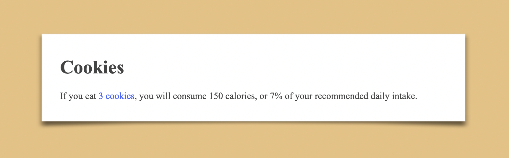

# Mangle

Another attempt at writing [Tangle.js](http://worrydream.com/Tangle/) documents in markdown.

The main objective here was to keep the "explanation" part as readable as possible, without loosing the power of javascript.

## Install

```shell
npm install -g mangle-doc
```

## Usage

```shell
mangle <example-file.mangle>
```

A "Mangle" document is split into three sections, separated by `---`:
1. the content (markdown)
2. the config (yaml)
3. the code (coffeescript)

## Example

example/cookies.mangle:

```mangle
# Cookies

If you eat `${cookies} cookies`, you will consume `${calories} calories`, or `${percent}%` of your recommended daily intake.

---
cookies:
  class: TKAdjustableNumber
  min: 0
  max: 10
  initial: 3
percent:
  format: %.0f

---
update = {cookies} ->
  calories: cookies*50,
  percent: cookies*2.38
```

```shell
mangle example/cookies.mangle
```



## Similar projects

- https://github.com/jqhoogland/remark-tangle
- https://github.com/alecperkins/active-markdown